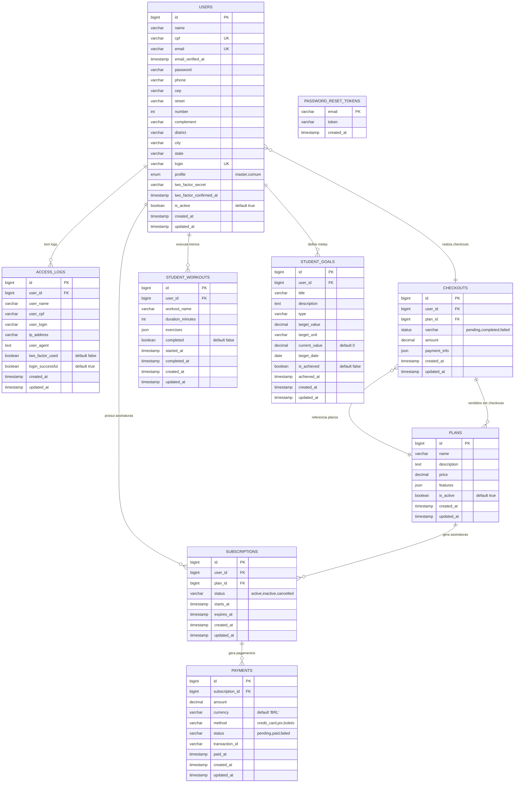

# 📊 Diagrama ER - FitPlan Academy

## 🏗️ Estrutura do Banco de Dados



## 🔗 Relacionamentos Principais

### 1. **USERS (Usuários)**
- **Perfis:** `master` (Administrador) e `comum` (Aluno)
- **Autenticação:** Login + Senha + 2FA
- **Endereço:** CEP, rua, número, complemento, bairro, cidade, estado
- **Contato:** Telefone e email únic

### 2. **ACCESS_LOGS (Logs de Acesso)**
- Registra todas as tentativas de login
- Inclui informações de segurança (IP, User Agent)
- Controla uso de 2FA
- Relaciona com USERS

### 3. **PLANS (Plans)**
- **Basic:** R$ 79,90 - Ideal para iniciantes
- **Smart:** R$ 129,90 - Mais popular
- **Black:** R$ 199,90 - Premium

### 4. **STUDENT_WORKOUTS (Treinos do Aluno)**
- Armazena treinos personalizados por usuário
- Inclui exercícios em formato JSON
- Controla status de conclusão
- Registra tempo de início e fim

### 5. **STUDENT_GOALS (Metas do Aluno)**
- Metas personalizadas (peso, frequência, força)
- Progresso em tempo real
- Data objetivo para conquista
- Controla conquista de metas

## 🎯 Funcionalidades Suportadas

✅ **Autenticação 2FA**
- Google Authenticator
- Logs de segurança

✅ **Gestão de Usuários**
- Perfis Master/Comum
- Validações brasileiras (CPF, CEP)

✅ **Dashboard do Aluno**
- Frequência mensal
- Progresso de metas
- Treinos personalizados

✅ **Sistema de Pagamentos**
- Assinaturas
- Múltiplos métodos de pagamento

✅ **Auditoria Completa**
- Logs de acesso
- Tracking de 2FA

## 📊 Estatísticas do Sistema

- **Tabelas:** 9 principais + 1 de tokens
- **Funcionalidades:** Autenticação, gestão, treinos, metas, pagamentos
- **Segurança:** 2FA, logs de acesso, validações
- **Escalabilidade:** Índices otimizados, foreign keys

## 🚀 Comandos de Setup

```bash
# Criar banco e executar migrações
php artisan migrate

# Criar usuário Master
php artisan db:seed --class=MasterUserSeeder

# Popular planos
php artisan db:seed --class=PlanSeeder

# Popular dados de demonstração do aluno
php artisan student:populate
```

---

**🏋️ FitPlan Academy - Sistema Completo de Gestão de Academia**
