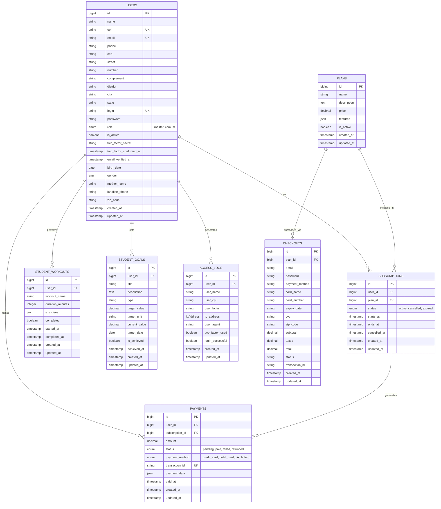

# Diagrama de Entidade e Relacionamento (DER) - FitPlan Academy

Este documento apresenta o diagrama de entidade e relacionamento (DER) do banco de dados do sistema FitPlan Academy, gerado a partir das migrações do Laravel.

## Diagrama Mermaid

## Descrição das Tabelas

### 1. Users (Usuários)
Tabela central que armazena todos os usuários do sistema (Master, Admin, Alunos).
- **Relacionamentos:** Possui assinaturas, pagamentos, treinos, metas e logs de acesso.

### 2. Plans (Planos)
Define os planos disponíveis na academia (ex: Basic, Smart, Black).
- **Relacionamentos:** Vinculado a assinaturas e checkouts.

### 3. Subscriptions (Assinaturas)
Registra a assinatura ativa de um usuário em um plano.
- **Relacionamentos:** Pertence a um usuário e a um plano. Gera pagamentos.

### 4. Payments (Pagamentos)
Histórico de pagamentos realizados.
- **Relacionamentos:** Vinculado a um usuário e a uma assinatura.

### 5. Checkouts
Registra tentativas de compra de planos (carrinho abandonado ou concluído).
- **Relacionamentos:** Vinculado a um plano.

### 6. Student Workouts (Treinos do Aluno)
Registra os treinos realizados pelos alunos.
- **Relacionamentos:** Pertence a um usuário.

### 7. Student Goals (Metas do Aluno)
Metas definidas pelos alunos (ex: perder peso).
- **Relacionamentos:** Pertence a um usuário.

### 8. Access Logs (Logs de Acesso)
Auditoria de logins no sistema.
- **Relacionamentos:** Pertence a um usuário.
